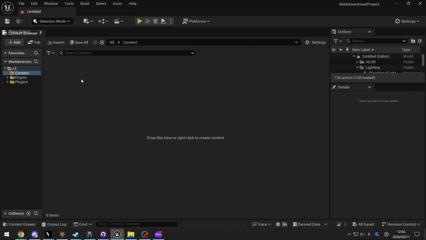
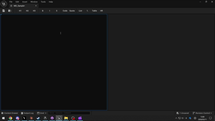
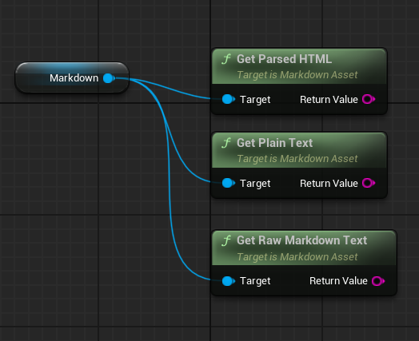

# クイックスタートガイド

Markdown Editor プラグインを数分でセットアップして使い始めましょう。

## 前提条件

- Unreal Engine 5.5
- C++ プロジェクト
- `WebBrowserWidget` プラグイン（依存関係として自動的に有効になります）

## 1. プラグインのインストール

1. `Plugins/MarkdownEditor` ディレクトリをプロジェクトの `Plugins/` フォルダにコピーします。
2. プロジェクトファイルを再生成してビルドします。
3. エディタを起動すると、プラグインが自動的に読み込まれます。

## 2. 最初の Markdown アセットを作成する

1. **コンテンツブラウザ** で右クリックし、**Markdown > Markdown Text** を選択します。
2. 新しいアセットをダブルクリックしてエディタを開きます。
3. 左ペインに Markdown を記述すると、右ペインに HTML プレビューがリアルタイムで表示されます。

> **ヒント:** コンテンツブラウザに含まれている `MD_Sample` アセットを開くと、サンプルを確認できます。





## 3. インポートとエクスポート

- **インポート** — `.md` または `.markdown` ファイルをコンテンツブラウザにドラッグします。
- **再インポート** — インポート済みアセットを右クリック > **再インポート** を選択します。
- **エクスポート** — アセットを右クリック > **アセットアクション > エクスポート** で `.md` ファイルとして保存します。

> **PDF / DOCX / PPTX / HTML をインポートする場合:** これらの形式は Microsoft の [markitdown](https://github.com/microsoft/markitdown) CLI を経由して変換されます。markitdown は任意の外部依存ツールなので、先にインストールしてください（`pip install "markitdown[all]"` または `uv`）。セットアップの詳細は [README.ja.md](README.ja.md) の **前提条件** および **Markitdown** セクションを参照してください。

## 4. ブループリントでの使用

`UMarkdownAsset` には、ブループリントから呼び出せる 3 つの関数があります:

| ノード | 説明 |
|------|-------------|
| `GetParsedHTML` | Markdown を HTML に変換します |
| `GetRawMarkdownText` | 生の Markdown ソースを返します |
| `GetPlainText` | Markdown 記号を除去したプレーンテキストを返します |



## 5. Wikilink でアセット間をリンクする

`[[アセット名]]` 構文を使って Markdown アセット同士をリンクできます:

```markdown
関連ドキュメント: [[設計メモ]]
```

- プレビュー内のwikilinkは **緑色（teal）** の破線付きリンクとして表示されます。
- リンクをクリックすると、対象の Markdown アセットが新しいタブで開きます。
- 存在しないアセットへのリンクは **赤色** で表示されるため、リンク切れを一目で確認できます。
- 通常の Markdown リンク（`[テキスト](https://...)`）はシステムブラウザで開きます。

## キーボードショートカット

| ショートカット | 操作 |
|----------|--------|
| Ctrl+B | 太字 |
| Ctrl+I | 斜体 |
| Ctrl+Shift+X | 取り消し線 |
| Ctrl+Shift+C | コードブロック |
| Ctrl+1 / 2 / 3 | 見出し 1 / 2 / 3 |
| Ctrl+Shift+U | 箇条書きリスト |
| Ctrl+Shift+O | 番号付きリスト |
| Ctrl+Shift+Q | 引用ブロック |
| — | テーブル挿入（ツールバーのみ） |
| — | 水平線（ツールバーのみ） |

## 次のステップ

プロジェクト構成や高度な機能を含む完全なドキュメントは [README.md](README.md) をご覧ください。
