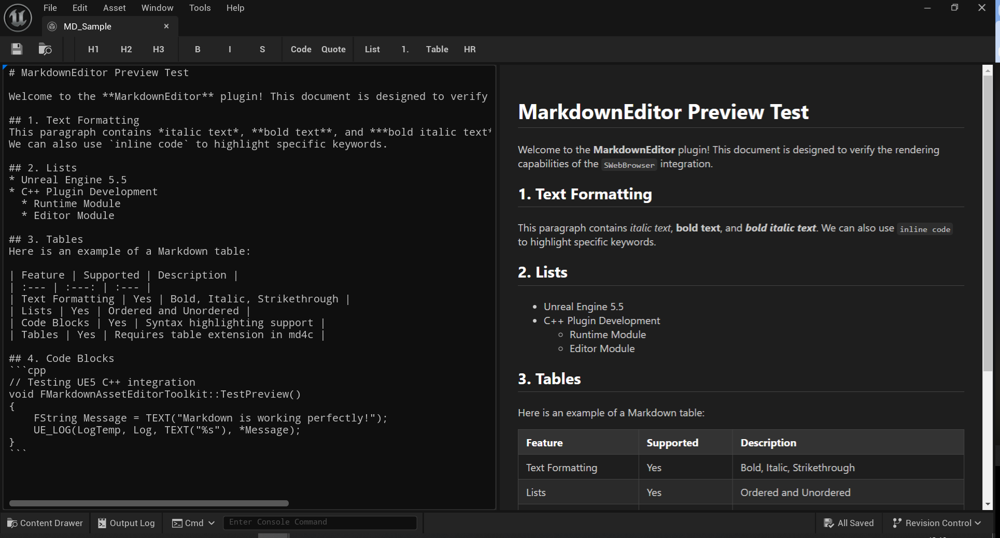
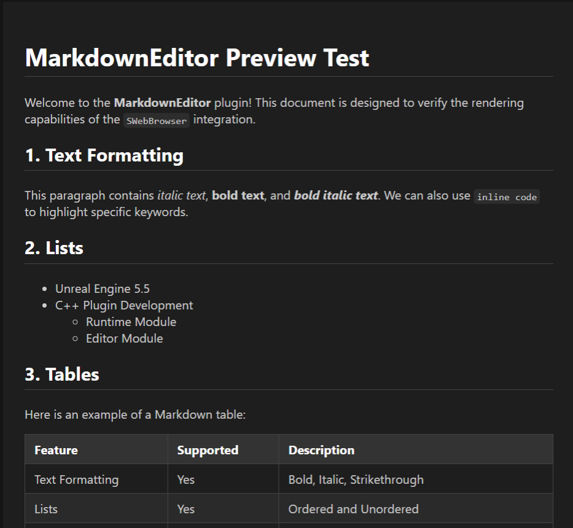
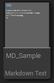
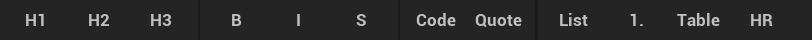
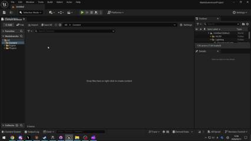
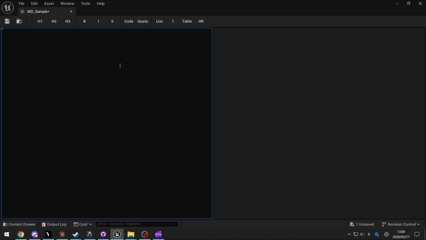
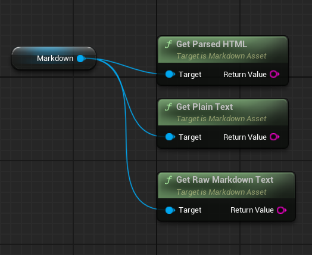

# MarkdownAssetProject

カスタムMarkdownアセットタイプとライブプレビューエディタを追加するUnreal Engine 5.5用プラグイン。

<!-- TODO: 画像を挿入 - デュアルペインMarkdownエディタのメインスクリーンショット（左: Markdownソース、右: HTMLプレビュー） -->


## 機能

- **カスタムMarkdownアセット** — `UMarkdownAsset`は生のMarkdownテキストをファーストクラスのUObjectとして保存します。
- **ライブHTMLプレビュー** — 左側にテキストエディタ、右側にリアルタイムのHTMLプレビューを備えたデュアルペインエディタ（スムーズな編集のため、0.3秒のデバウンス処理により更新されます）。
- **md4c統合** — 組み込まれた[md4c](https://github.com/mity/md4c) Cライブラリを利用した高速なMarkdownからHTMLへの変換。
- **ダークテーマ** — 快適に読めるように暗い背景でスタイリングされたHTML出力。
- **コンテンツブラウザの統合** — コンテキストメニューから直接新しいMarkdownアセットを作成できます。「MD」ラベルとコンテンツの最初の数行を表示するカスタムサムネイルプレビュー付きです。
- **インポート / エクスポート** — `.md` / `.markdown` ファイルをコンテンツブラウザにドラッグ＆ドロップしてインポート、ソースファイルからのリインポート、および `.md` ファイルへのエクスポートに対応。
- **GitHub Flavored Markdown** — `MD_DIALECT_GITHUB` フラグにより、テーブル、タスクリスト、取り消し線などの GFM 拡張構文をサポート。
- **Blueprint サポート** — Blueprint から `RawMarkdownText` の読み書きと `GetParsedHTML()`、`GetRawMarkdownText()`、`GetPlainText()` の呼び出しが可能。
- **ツールバーとキーボードショートカット** — 一般的なMarkdown操作のためのキーボードショートカットを備えた組み込みのフォーマットツールバー。

<!-- TODO: 画像を挿入 - ダークテーマが適用されたHTMLプレビューペインの表示例 -->


<!-- TODO: 画像を挿入 - コンテンツブラウザ上の「MD」ラベルとコンテンツプレビュー付きサムネイル -->


### キーボードショートカット

| コマンド | ショートカット |
|---------|----------|
| 太字 | Ctrl+B |
| 斜体 | Ctrl+I |
| 取り消し線 | Ctrl+Shift+X |
| コードブロック | Ctrl+Shift+C |
| 見出し 1 | Ctrl+1 |
| 見出し 2 | Ctrl+2 |
| 見出し 3 | Ctrl+3 |
| 箇条書き | Ctrl+Shift+U |
| 番号付きリスト | Ctrl+Shift+O |
| 引用ブロック | Ctrl+Shift+Q |
| テーブル挿入 | — |
| 水平線 | — |

<!-- TODO: 画像を挿入 - フォーマットツールバーのボタン（Bold、Italic、Headingなど）のクローズアップ -->


## 要件

- Unreal Engine 5.5
- C++プロジェクト (プラグインにネイティブモジュールが含まれているため)
- `WebBrowserWidget` プラグイン (依存関係として自動的に有効になります)

## インストール

1. `Plugins/MarkdownEditor`ディレクトリをプロジェクトの`Plugins/`フォルダにクローンまたはコピーします。
2. プロジェクトファイルを再生成してビルドします。
3. エディタ起動時にプラグインが自動的に読み込まれます。

## 使用方法

1. コンテンツブラウザで右クリックし、**Miscellaneous > Markdown Text** を選択して新しいアセットを作成します。
2. アセットをダブルクリックしてMarkdownエディタを開きます。
3. 左側のペインにMarkdownを記述すると、右側のペインでHTMLプレビューがリアルタイムに更新されます。

<!-- TODO: GIFを挿入 - コンテンツブラウザの右クリックメニューから新規Markdownアセットを作成する操作の録画 -->


<!-- TODO: GIFを挿入 - Markdownを入力するとHTMLプレビューがリアルタイムで更新される様子の録画 -->


### インポート / エクスポート

- **インポート**: `.md` または `.markdown` ファイルをコンテンツブラウザにドラッグするとMarkdownアセットが作成されます。
- **リインポート**: インポートしたアセットを右クリックし、**Reimport** を選択すると元のソースファイルから再読み込みできます。
- **エクスポート**: Markdownアセットを右クリックし、**Asset Actions > Export** を選択すると `.md` ファイルとして保存できます。

<!-- TODO: GIFを挿入 - ドラッグ＆ドロップによるインポートとエクスポートメニューの操作録画 -->


### Blueprint ノード

`UMarkdownAsset` は以下の Blueprint から呼び出し可能な関数を公開しています:

| ノード | 戻り値の型 | 説明 |
|------|-------------|-------------|
| `GetParsedHTML` | `FString` | md4c を使用して Markdown テキストを HTML 文字列に変換します |
| `GetRawMarkdownText` | `FString` | 生の Markdown テキストをそのまま返します |
| `GetPlainText` | `FString` | すべての Markdown 記号を除去したテキストを返します |

- **GetPlainText** は、Markdown / HTML の描画ができない UMG Widget や 3D テキストで Markdown コンテンツを表示する場合に便利です。
- **GetRawMarkdownText** は、ソースの Markdown をそのまま返します。将来の拡張（カスタムレンダリングパイプラインなど）を想定しています。

<!-- TODO: 画像を挿入 - ブループリントエディタでGetParsedHTML、GetRawMarkdownText、GetPlainTextノードを使用している例 -->


## プロジェクト構造

```
Plugins/MarkdownEditor/
├── Source/
│   ├── MarkdownAsset/            # ランタイムモジュール
│   │   ├── Public/Private/       # UMarkdownAssetクラスとmd4cラッパー
│   │   └── ThirdParty/md4c/     # 組み込みのmd4cパーサーライブラリ
│   └── MarkdownAssetEditor/      # エディタモジュール
│       └── Public/Private/       # アセットファクトリ、アクション、エディタツールキット
└── MarkdownEditor.uplugin
```

| モジュール | ロードフェーズ | 目的 |
|---|---|---|
| `MarkdownAsset` | Runtime | コアアセットクラスとMarkdownからHTMLへの変換 |
| `MarkdownAssetEditor` | Editor | ライブプレビューを備えたカスタムアセットエディタUI |

## ライセンス

このプロジェクトは [MIT License](LICENSE) の下でライセンスされています。
