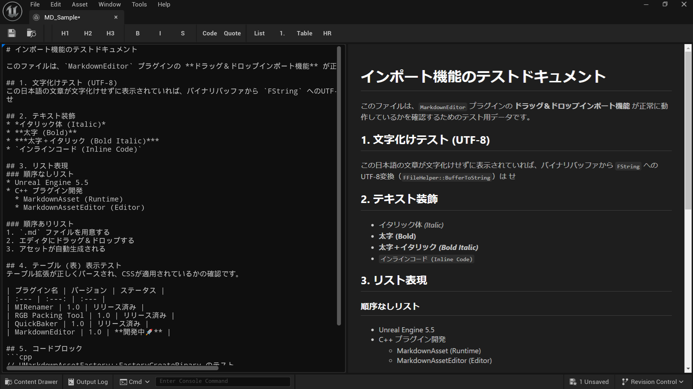

# MarkdownAssetProject

> **English version: [README.md](README.md)**


カスタムMarkdownアセットタイプとライブプレビューエディタを追加するUnreal Engine 5.5以降用プラグイン。



## 機能

- **カスタムMarkdownアセット** — `UMarkdownAsset`は生のMarkdownテキストをファーストクラスのUObjectとして保存します。
- **ライブHTMLプレビュー** — 左側にテキストエディタ、右側にリアルタイムのHTMLプレビューを備えたデュアルペインエディタ（スムーズな編集のため、0.3秒のデバウンス処理により更新されます）。
- **md4c統合** — 組み込まれた[md4c](https://github.com/mity/md4c) Cライブラリを利用した高速なMarkdownからHTMLへの変換を実現しました。
- **ダークテーマ** — 快適に読めるように暗い背景でスタイリングされたHTML出力。
- **コンテンツブラウザの統合** — コンテキストメニューから直接新しいMarkdownアセットを作成できます。「MD」ラベルとコンテンツの最初の数行を表示するカスタムサムネイルプレビュー付きです。
- **インポート / エクスポート** — `.md` / `.markdown` ファイルをコンテンツブラウザにドラッグ＆ドロップしてインポート、ソースファイルからのリインポート、および `.md` ファイルへのエクスポートに対応しています。
- **GitHub Flavored Markdown** — `MD_DIALECT_GITHUB` フラグにより、テーブル、タスクリスト、取り消し線などの GFM 拡張構文をサポートしました。
- **Blueprint サポート** — Blueprint から `RawMarkdownText` の読み書きと `GetParsedHTML()`、`GetRawMarkdownText()`、`GetPlainText()` の呼び出しが可能です。
- **ツールバーとキーボードショートカット** — 一般的なMarkdown操作のためのキーボードショートカットを備えた組み込みのフォーマットツールバーを用意しています。
- **元に戻す / やり直し** — Unreal Editorのトランザクションシステムと統合された完全なUndo/Redoサポート（Ctrl+Z / Ctrl+Y）
- **セキュリティ** — ユーザー提供のMarkdownレンダリング時のXSSを防止するため、生のHTMLブロックおよびインラインHTMLはデフォルトで無効化しています。
- **ローカライズ** — エディタUIは英語と日本語に対応しています。
- **ニバイト文字対応** — 日本語などのニバイト文字を含むMarkdownテキストを正しく処理・表示できます。


### キーボードショートカット

| コマンド | ショートカット |
|---------|----------|
| 太字 | Ctrl+B |
| 斜体 | Ctrl+I |
| 取り消し線 | Ctrl+Shift+X |
| コードブロック | Ctrl+Shift+C |
| 見出し 1 | Ctrl+1 |
| 見出し 2 | Ctrl+2 |
| 見出し 3 | Ctrl+3 |
| 箇条書き | Ctrl+Shift+U |
| 番号付きリスト | Ctrl+Shift+O |
| 引用ブロック | Ctrl+Shift+Q |
| テーブル挿入 | — |
| 水平線 | — |


## 要件

- Unreal Engine 5.5 以降
- C++プロジェクト (プラグインにネイティブモジュールが含まれているため)
- `WebBrowserWidget` プラグイン (依存関係として自動的に有効になります)

## インストール

1. `Plugins/MarkdownEditor`ディレクトリをプロジェクトの`Plugins/`フォルダにクローンまたはコピーします。
2. プロジェクトファイルを再生成してビルドします。
3. エディタ起動時にプラグインが自動的に読み込まれます。

## 使用方法

> **クイックスタート:** ステップバイステップのガイドは [QUICKSTART.ja.md](QUICKSTART.ja.md) をご覧ください。

1. コンテンツブラウザで右クリックし、**Markdown > Markdown Text** を選択して新しいアセットを作成します。
2. アセットをダブルクリックしてMarkdownエディタを開きます。
3. 左側のペインにMarkdownを記述すると、右側のペインでHTMLプレビューがリアルタイムに更新されます。


### インポート / エクスポート

- **インポート**: `.md` または `.markdown` ファイルをコンテンツブラウザにドラッグするとMarkdownアセットが作成されます。
- **リインポート**: インポートしたアセットを右クリックし、**Reimport** を選択すると元のソースファイルから再読み込みできます。
- **エクスポート**: Markdownアセットを右クリックし、**Asset Actions > Export** を選択すると `.md` ファイルとして保存できます。

### Blueprint ノード

`UMarkdownAsset` は以下の Blueprint から呼び出し可能な関数を公開しています:

| ノード | 戻り値の型 | 説明 |
|------|-------------|-------------|
| `GetParsedHTML` | `FString` | md4c を使用して Markdown テキストを HTML 文字列に変換します |
| `GetRawMarkdownText` | `FString` | 生の Markdown テキストをそのまま返します |
| `GetPlainText` | `FString` | すべての Markdown 記号を除去したテキストを返します |

- **GetPlainText** は、Markdown / HTML の描画ができない UMG Widget や 3D テキストで Markdown コンテンツを表示する場合に便利です。
- **GetRawMarkdownText** は、ソースの Markdown をそのまま返します。将来の拡張（カスタムレンダリングパイプラインなど）を想定しています。


## プロジェクト構造

```
Plugins/MarkdownEditor/
├── Source/
│   ├── MarkdownAsset/            # ランタイムモジュール
│   │   ├── Public/Private/       # UMarkdownAssetクラスとmd4cラッパー
│   │   └── ThirdParty/md4c/     # 組み込みのmd4cパーサーライブラリ
│   └── MarkdownAssetEditor/      # エディタモジュール
│       └── Public/Private/       # アセットファクトリ、アクション、エディタツールキット
└── MarkdownEditor.uplugin
```

| モジュール | ロードフェーズ | 目的 |
|---|---|---|
| `MarkdownAsset` | Runtime | コアアセットクラスとMarkdownからHTMLへの変換 |
| `MarkdownAssetEditor` | Editor | ライブプレビューを備えたカスタムアセットエディタUI |

## 今後の実装予定

### エディタ
- **シンタックスハイライト** — テキストエディタ内でMarkdown構文をカラーハイライト表示
- **検索と置換** — エディタ内テキスト検索・置換機能（Ctrl+F / Ctrl+H）
- **テーマ切り替え** — ライトテーマの追加とテーマ選択機能

### プレビュー
- **Mermaid図表サポート** — Mermaidによるフローチャート・シーケンス図などの描画
- **画像プレビュー** — Markdown内で参照されている画像をHTMLプレビューに表示

### アセットパイプライン
- **PDF / HTMLエクスポート** — MarkdownアセットをPDFまたはスタンドアロンHTMLファイルとしてエクスポート

### プラットフォーム
- **マルチプラットフォーム対応** — macOSおよびLinuxへの対応

### 必須ランタイム
- **UMG Markdownウィジェット** — ゲーム内UIでMarkdownを直接レンダリングするUMGウィジェット

## FAQ

**Q. このプラグインはパッケージ化されたゲームで動作しますか？**
A. はい。Markdownエディタとライブプレビューはエディタ専用の機能ですが、`UMarkdownAsset` とそのBlueprintから呼び出し可能な関数（`GetParsedHTML` など）はランタイムモジュールの一部であり、パッケージ化されたビルドでも問題なく動作します。

**Q. Markdownの解析にインターネット接続は必要ですか？**
A. いいえ。プラグインはモジュールに静的リンクされた軽量な md4c Cライブラリを使用しています。すべてのMarkdownからHTMLへの変換はローカルで即座に行われます。

**Q. ゲームのUIでMarkdownコンテンツを表示するにはどうすればよいですか？**
A. いくつかの方法があります:
1. `GetParsedHTML` Blueprintノードを使用し、その結果を WebBrowser UMG ウィジェットに渡すことで、完全にスタイリングされたテキストを表示できます。
2. `GetPlainText` ノードを使用して、すべてのMarkdownフォーマットを除去し、標準の UMG Text Block に表示できます。

**Q. VSCodeなどの外部エディタで .md ファイルを編集できますか？**
A. はい。任意の `.md` または `.markdown` ファイルをコンテンツブラウザにインポートできます。外部で元のファイルを編集した場合は、Unreal Engineでアセットを右クリックし、**Reimport** を選択するだけで更新できます。

**Q. WebBrowserWidget プラグインは必須ですか？**
A. はい。カスタムエディタでライブHTMLプレビューを描画するには、エンジン組み込みの WebBrowserWidget プラグインが必要です。このプラグインが自動的に有効化します。

## ライセンス

このプロジェクトは [MIT License](LICENSE) の下でライセンスされています。
