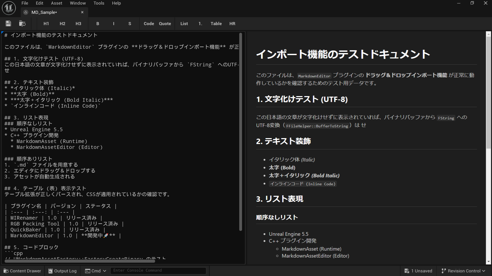
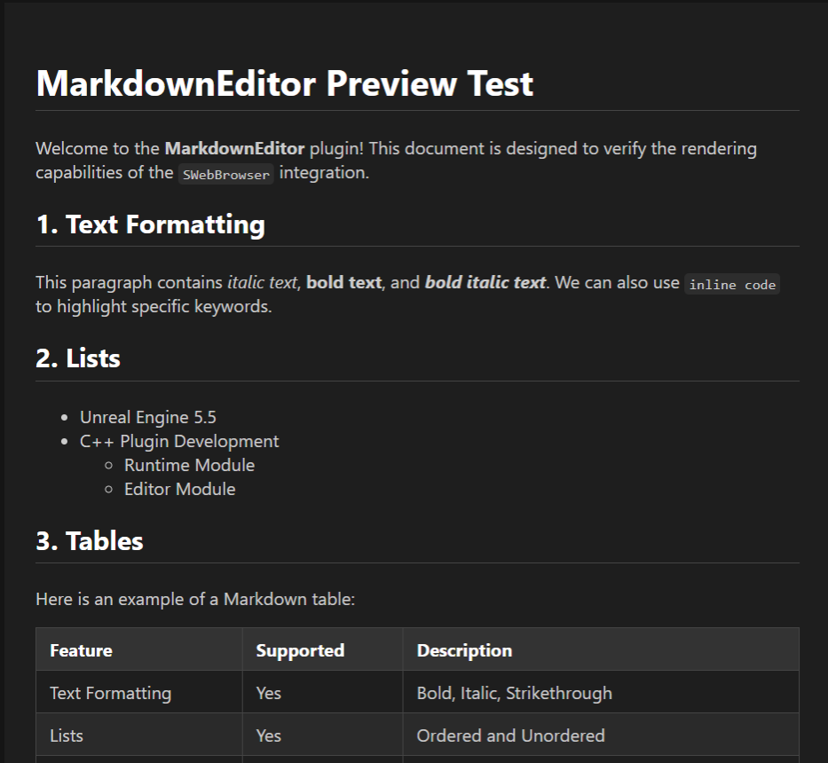
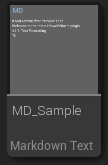
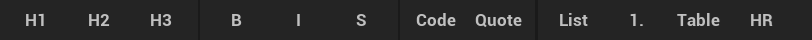

# MarkdownAssetProject

> **English version: [README.md](README.md)**


[](https://www.fab.com/listings/21ba464a-d8fa-48f5-833d-6894dbe9fe95)

カスタムMarkdownアセットタイプとライブプレビューエディタを追加するUnreal Engine 5.5以降用プラグイン。



## 機能

- **カスタムMarkdownアセット** — `UMarkdownAsset`は生のMarkdownテキストをファーストクラスのUObjectとして保存します。
- **ライブHTMLプレビュー** — 左側にテキストエディタ、右側にリアルタイムのHTMLプレビューを備えたデュアルペインエディタ（スムーズな編集のため、0.3秒のデバウンス処理により更新されます）。
- **md4c統合** — 組み込まれた[md4c](https://github.com/mity/md4c) Cライブラリを利用した高速なMarkdownからHTMLへの変換を実現しました。
- **ダークテーマ** — 快適に読めるように暗い背景でスタイリングされたHTML出力。
- **コンテンツブラウザの統合** — コンテキストメニューから直接新しいMarkdownアセットを作成できます。「MD」ラベルとコンテンツの最初の数行を表示するカスタムサムネイルプレビュー付きです。
- **インポート / エクスポート** — `.md` / `.markdown` ファイルをコンテンツブラウザにドラッグ＆ドロップしてインポート、ソースファイルからのリインポート、および `.md` ファイルへのエクスポートに対応しています。
- **Markitdown 連携** — Microsoft の [markitdown](https://github.com/microsoft/markitdown) CLI を経由して `.pdf` / `.docx` / `.pptx` / `.html` / `.htm` ファイルをコンテンツブラウザに直接インポートできます。Reimport は保存された元ファイルパスに対して再変換を実行します。**Tools > Markdown > Batch Convert to Markdown...** からファイル選択ダイアログを開いて複数の `UMarkdownAsset` をまとめて作成でき、進捗ダイアログはキャンセル可能です。`UMarkitdownBlueprintLibrary` を通じて Editor Utility Widget やエディタスクリプトから変換ヘルパーを呼び出せます。
- **GitHub Flavored Markdown** — `MD_DIALECT_GITHUB` フラグにより、テーブル、タスクリスト、取り消し線などの GFM 拡張構文をサポートしました。
- **Wikilink** — `[[アセット名]]` と記述するだけでアセット間リンクを作成できます。プレビュー内のリンクをクリックすると、対象のMarkdownアセットが新しいタブで開きます。存在しないアセットへのリンクは赤色で表示されます。
- **アセット・クラスリンク** — 標準Markdown構文 `[ラベル](/Game/Path/To/Asset)` でContent Browserのアセット（Blueprintを含む）、`[ラベル](class://クラス名)` でC++またはBlueprintクラスへのリンクを記述できます。クリックすると対応するアセットエディタが開き、C++クラスの場合はIDEでソースファイルが開きます。解決できないリンクは赤色で表示されます。
- **Blueprint サポート** — Blueprint から `RawMarkdownText` の読み書きと `GetParsedHTML()`、`GetRawMarkdownText()`、`GetPlainText()` の呼び出しが可能です。
- **ツールバーとキーボードショートカット** — 一般的なMarkdown操作のためのキーボードショートカットを備えた組み込みのフォーマットツールバーを用意しています。
- **元に戻す / やり直し** — Unreal Editorのトランザクションシステムと統合された完全なUndo/Redoサポート（Ctrl+Z / Ctrl+Y）
- **セキュリティ** — ユーザー提供のMarkdownレンダリング時のXSSを防止するため、生のHTMLブロックおよびインラインHTMLはデフォルトで無効化しています。また、プレビューブラウザのナビゲーションはホワイトリスト方式を採用しており、`data:`・`about:`・`mdasset://`・`ueasset://`・`class://`・`http(s)://` のみを許可し、`javascript:` や `file:` などの未知スキームをブロックすることで、信頼できないMarkdownによるスクリプト実行やローカルファイルアクセスを防いでいます。さらに、プレビューページには `Content-Security-Policy`（`default-src 'none'; style-src 'unsafe-inline'; img-src data:`）を注入し、外部ネットワークへのリクエスト（外部画像・fetch/XHR・フレーム等）をブロックすることで、IP追跡やローカルサービスへのSSRFを防止しています。外部 `http(s)://` リンクをクリックした際は必ず確認ダイアログで完全なURLを表示してからシステムブラウザで開くため、細工されたMarkdownアセットによるフィッシングを軽減します。
- **ローカライズ** — エディタUIは英語と日本語に対応しています。
- **ニバイト文字対応** — 日本語などのニバイト文字を含むMarkdownテキストを正しく処理・表示できます。





### キーボードショートカット

| コマンド | ショートカット |
|---------|----------|
| 太字 | Ctrl+B |
| 斜体 | Ctrl+I |
| 取り消し線 | Ctrl+Shift+X |
| コードブロック | Ctrl+Shift+C |
| 見出し 1 | Ctrl+1 |
| 見出し 2 | Ctrl+2 |
| 見出し 3 | Ctrl+3 |
| 箇条書き | Ctrl+Shift+U |
| 番号付きリスト | Ctrl+Shift+O |
| 引用ブロック | Ctrl+Shift+Q |
| テーブル挿入 | — |
| 水平線 | — |



## 要件

- Unreal Engine 5.5 以降
- C++プロジェクト (プラグインにネイティブモジュールが含まれているため)
- `WebBrowserWidget` プラグイン (依存関係として自動的に有効になります)
- **オプション (Markitdown 使用時のみ)**: Python 3.10 以降 + `markitdown` パッケージ (`pip install markitdown`)、または [`uv`](https://github.com/astral-sh/uv) が `PATH` 上にあること。`.pdf` / `.docx` / `.pptx` / `.html` 等のインポートでのみ必要で、`.md` 中心のワークフローでは不要です。

## インストール

1. `Plugins/MarkdownEditor`ディレクトリをプロジェクトの`Plugins/`フォルダにクローンまたはコピーします。
2. プロジェクトファイルを再生成してビルドします。
3. エディタ起動時にプラグインが自動的に読み込まれます。

## 使用方法

> **クイックスタート:** ステップバイステップのガイドは [QUICKSTART.ja.md](QUICKSTART.ja.md) をご覧ください。

1. コンテンツブラウザで右クリックし、**Markdown > Markdown Text** を選択して新しいアセットを作成します。
2. アセットをダブルクリックしてMarkdownエディタを開きます。
3. 左側のペインにMarkdownを記述すると、右側のペインでHTMLプレビューがリアルタイムに更新されます。


### インポート / エクスポート

- **インポート**: `.md` または `.markdown` ファイルをコンテンツブラウザにドラッグするとMarkdownアセットが作成されます。
- **リインポート**: インポートしたアセットを右クリックし、**Reimport** を選択すると元のソースファイルから再読み込みできます。
- **エクスポート**: Markdownアセットを右クリックし、**Asset Actions > Export** を選択すると `.md` ファイルとして保存できます。

### Markitdown 連携 (PDF / DOCX / PPTX / HTML)

Markdown 以外のソースファイルは [markitdown](https://github.com/microsoft/markitdown) CLI を経由して取り込めます。変換結果が新規 `UMarkdownAsset` の本文になります。

- **設定**: **Project Settings > Plugins > Markitdown** で実行モードを選択します:
  - `uvx`（デフォルト） — `uvx markitdown ...` を実行。[`uv`](https://github.com/astral-sh/uv) が `PATH` 上にある必要があります
  - `System Python` — `python -m markitdown ...` を実行。`PATH` に無い場合は Python Executable Path を指定
  - `Custom` — 任意の実行ファイルパスを Custom Command で指定
- **単一ファイル**: `.pdf` / `.docx` / `.pptx` / `.html` / `.htm` をコンテンツブラウザにドラッグ。markitdown 実行中は進捗ダイアログが表示され、ソースパスが保存されるので **Reimport** で再変換できます。
- **一括変換**: **Tools > Markdown > Batch Convert to Markdown...** からファイルを複数選択して `/Game/Markdown/` 配下（または Blueprint ヘルパーに渡したパス）に一括生成。進捗ダイアログはキャンセル可能です。
- **Blueprint / EUW**: `UMarkitdownBlueprintLibrary` が `PromptForSourceFiles` / `ConvertFileToMarkdownAsset` / `ConvertFilesToMarkdownAssets` / `RunBatchConvertWizard` を公開しているので、独自の Editor Utility Widget に組み込めます。

### リンク構文

Markdownアセットは他のMarkdownノート、Content Browserアセット、Blueprint、C++クラスへクロスリンクできます。ライブプレビューでリンクをクリックすると対象が開きます:

| 構文 | 対象 | 開かれるもの |
|------|------|-------------|
| `[[ノート名]]` | 他の `UMarkdownAsset` | Markdownエディタタブ |
| `[ラベル](/Game/Path/To/Asset)` | Content Browserの任意のアセット | アセットエディタ |
| `[ラベル](/Engine/BasicShapes/Cube)` | Engine同梱アセット | アセットエディタ |
| `[ラベル](class://クラス名)` | ネイティブC++クラス | IDEのソースファイル（`.cpp` 優先、`.h` フォールバック） |
| `[ラベル](class://BP_MyActor)` | Blueprintクラス | Blueprintエディタ |
| `[ラベル](https://...)` | 外部URL | システムブラウザ |

Unrealアセットリンクとして認識されるパスルート: `/Game/`, `/Engine/`, `/Plugins/`, `/Script/`。クラス名はUHTのリフレクション名と照合されるため、プレフィックス付き (`AActor`) と除去済み (`Actor`) の両形式が正しく解決されます。解決できない対象は赤色で表示されます。

### Blueprint ノード

`UMarkdownAsset` は以下の Blueprint から呼び出し可能な関数を公開しています:

| ノード | 戻り値の型 | 説明 |
|------|-------------|-------------|
| `GetParsedHTML` | `FString` | md4c を使用して Markdown テキストを HTML 文字列に変換します |
| `GetRawMarkdownText` | `FString` | 生の Markdown テキストをそのまま返します |
| `GetPlainText` | `FString` | すべての Markdown 記号を除去したテキストを返します |

- **GetPlainText** は、Markdown / HTML の描画ができない UMG Widget や 3D テキストで Markdown コンテンツを表示する場合に便利です。
- **GetRawMarkdownText** は、ソースの Markdown をそのまま返します。将来の拡張（カスタムレンダリングパイプラインなど）を想定しています。


`UMarkitdownBlueprintLibrary` (エディタ専用) は Editor Utility Widget やエディタスクリプトから呼び出せる一括変換ヘルパーを提供します:

| ノード | 戻り値の型 | 説明 |
|------|-------------|-------------|
| `PromptForSourceFiles` | `TArray<FString>` | markitdown 対応形式でフィルタした OS ファイルピッカーを開きます |
| `ConvertFileToMarkdownAsset` | `UMarkdownAsset*` | 単一ファイルを同期変換し、指定パッケージパス配下に新規アセットを作成します |
| `ConvertFilesToMarkdownAssets` | `TArray<UMarkdownAsset*>` | 複数ファイルをキャンセル可能な進捗ダイアログ付きで一括変換します |
| `RunBatchConvertWizard` | `void` | ファイル選択 → バッチ変換 → 完了通知までを一括実行するウィザード |

## プロジェクト構造

```
Plugins/MarkdownEditor/
├── Source/
│   ├── MarkdownAsset/            # ランタイムモジュール
│   │   ├── Public/Private/       # UMarkdownAssetクラスとmd4cラッパー
│   │   └── ThirdParty/md4c/     # 組み込みのmd4cパーサーライブラリ
│   └── MarkdownAssetEditor/      # エディタモジュール
│       └── Public/Private/       # アセットファクトリ、アクション、エディタツールキット
└── MarkdownEditor.uplugin
```

| モジュール | ロードフェーズ | 目的 |
|---|---|---|
| `MarkdownAsset` | Runtime | コアアセットクラスとMarkdownからHTMLへの変換 |
| `MarkdownAssetEditor` | Editor | ライブプレビューを備えたカスタムアセットエディタUI |

## 今後の実装予定

### エディタ
- **シンタックスハイライト** — テキストエディタ内でMarkdown構文をカラーハイライト表示
- **検索と置換** — エディタ内テキスト検索・置換機能（Ctrl+F / Ctrl+H）
- **テーマ切り替え** — ライトテーマの追加とテーマ選択機能

### プレビュー
- **Mermaid図表サポート** — Mermaidによるフローチャート・シーケンス図などの描画
- **画像プレビュー** — Markdown内で参照されている画像をHTMLプレビューに表示

### アセットパイプライン
- **PDF / HTMLエクスポート** — MarkdownアセットをPDFまたはスタンドアロンHTMLファイルとしてエクスポート

### プラットフォーム
- **マルチプラットフォーム対応** — macOSおよびLinuxへの対応

### 必須ランタイム
- **UMG Markdownウィジェット** — ゲーム内UIでMarkdownを直接レンダリングするUMGウィジェット

## FAQ

**Q. このプラグインはパッケージ化されたゲームで動作しますか？**
A. はい。Markdownエディタとライブプレビューはエディタ専用の機能ですが、`UMarkdownAsset` とそのBlueprintから呼び出し可能な関数（`GetParsedHTML` など）はランタイムモジュールの一部であり、パッケージ化されたビルドでも問題なく動作します。

**Q. Markdownの解析にインターネット接続は必要ですか？**
A. いいえ。プラグインはモジュールに静的リンクされた軽量な md4c Cライブラリを使用しています。すべてのMarkdownからHTMLへの変換はローカルで即座に行われます。

**Q. ゲームのUIでMarkdownコンテンツを表示するにはどうすればよいですか？**
A. いくつかの方法があります:
1. `GetParsedHTML` Blueprintノードを使用し、その結果を WebBrowser UMG ウィジェットに渡すことで、完全にスタイリングされたテキストを表示できます。
2. `GetPlainText` ノードを使用して、すべてのMarkdownフォーマットを除去し、標準の UMG Text Block に表示できます。

**Q. VSCodeなどの外部エディタで .md ファイルを編集できますか？**
A. はい。任意の `.md` または `.markdown` ファイルをコンテンツブラウザにインポートできます。外部で元のファイルを編集した場合は、Unreal Engineでアセットを右クリックし、**Reimport** を選択するだけで更新できます。

**Q. WebBrowserWidget プラグインは必須ですか？**
A. はい。カスタムエディタでライブHTMLプレビューを描画するには、エンジン組み込みの WebBrowserWidget プラグインが必要です。このプラグインが自動的に有効化します。

## ライセンス

このプロジェクトは [MIT License](LICENSE) の下でライセンスされています。
